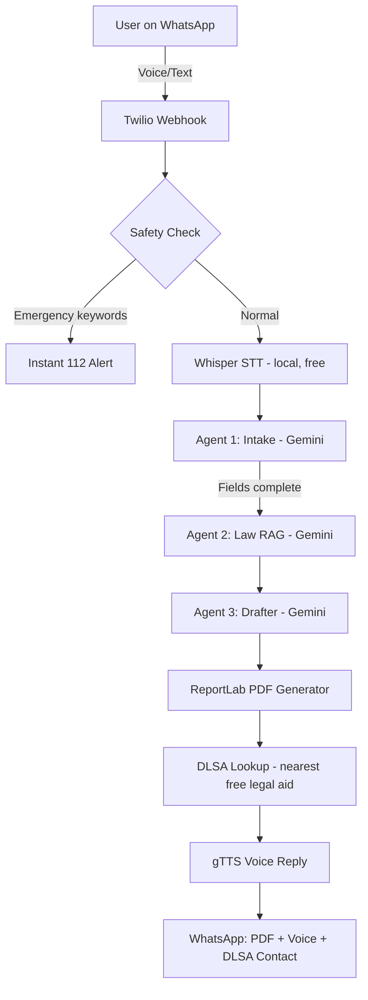

# ⚖️ Nyaya Sakhi — AI-Powered Legal Aid for Rural Indian Women

> *न्याय सखी* — "A friend who brings justice"


**ScriptedBy{Her} 2.0 · Meesho Women's Hackathon 2026 · Team AAA · NMAM Institute of Technology**

---

## 🎯 Problem

India has a critical legal access gap — roughly 1 lawyer per 1,000 citizens vs 1 per 250 in the US. Rural women sit at the intersection of three compounding barriers:
- **Geographic**: courts are far
- **Economic**: lawyers are unaffordable
- **Literacy**: legal documents require education

Result: **73% of affected women never file a complaint.**

---

## 💡 Solution

Nyaya Sakhi collapses these barriers using agentic AI — delivering a compassionate, multilingual legal co-pilot directly through **WhatsApp**, available **24/7**, at **zero cost**.

**Voice note → FIR PDF in under 2 minutes**, plus a spoken explanation back to her in her own language, and the contact for her nearest free legal aid office.

---

## 🏗️ Architecture



**3 AI agents, used only where language understanding/generation is genuinely needed:**
- **Agent 1 (Intake)** — has a real, gentle conversation to extract her case details, detects and matches her language (Hindi/Kannada/Tamil/English)
- **Agent 2 (Law RAG)** — identifies the specific Indian legal sections that apply to her exact case (no padding with unrelated laws)
- **Agent 3 (Drafter)** — writes a formal, first-person FIR application citing the correct sections

Everything else — WhatsApp messaging, PDF generation, session tracking, emergency detection, DLSA lookup — is plain Python code, not AI.

---

## 🔗 Live Links

- **Live Demo Dashboard**: https://nyaya-sakhi.netlify.app *(update with your actual Netlify URL)*
- **Deployed Backend**: https://nyaya-sakhi.onrender.com *(update with your actual Render URL)*
- **GitHub Repository**: https://github.com/AnchalRaoN/nyaya-sakhi
- **WhatsApp Sandbox**: Message `+1 415 523 8886` after joining the Twilio sandbox

---

## 🚀 Quick Start (Run Locally)

### Prerequisites
- Python 3.11+
- Git
- ffmpeg (required for voice note transcription — `winget install ffmpeg` on Windows)

### 1. Clone the repo
```bash
git clone https://github.com/AnchalRaoN/nyaya-sakhi.git
cd nyaya-sakhi
```

### 2. Install dependencies
```bash
pip install -r requirements.txt
```

### 3. Set up environment variables
```bash
cp .env.example .env
# Fill in your API keys (see below)
```

### 4. Run the server
```bash
uvicorn main:app --reload --port 8000
```

### 5. Open the dashboard
Open `frontend/index.html` in your browser — no build step needed. It auto-detects local vs deployed backend.

### 6. Connect WhatsApp (optional, for full testing)
Use [ngrok](https://ngrok.com) to expose your local server, then set the resulting URL as your Twilio WhatsApp Sandbox webhook (`/webhook/whatsapp`).

---

## 🔑 Required API Keys

| Service | Where to get it | Cost |
|---|---|---|
| Google Gemini | [aistudio.google.com](https://aistudio.google.com) | **Free tier available** |
| Twilio | [twilio.com](https://twilio.com) | Free trial |

That's it — only 2 external services required. No paid dependencies.

---

## 📡 API Endpoints

| Method | Endpoint | Description |
|---|---|---|
| POST | `/webhook/whatsapp` | Twilio WhatsApp webhook |
| POST | `/api/demo` | Demo pipeline (no WhatsApp needed, powers the dashboard) |
| GET | `/api/stats` | Live session statistics |
| GET | `/` | Health check |

---

## 🧠 Agent Details

### Agent 1 — Intake
- **Model**: Gemini (with automatic fallback across available model versions)
- **Job**: Conversational, one-question-at-a-time extraction of case details — incident type, date, location, perpetrator, evidence, desired outcome, and enough narrative detail (frequency/duration) to draft a credible FIR
- **Languages**: Hindi, Kannada, Tamil, English — detects and mirrors her language and script every turn
- **Smart behaviors**: auto-captures her WhatsApp name/number (never asks), gently redirects off-topic replies once before moving on, caps at 8 exchanges to avoid infinite loops

### Agent 2 — Law RAG
- **Model**: Gemini, called fresh per case with strict filtering rules
- **Job**: Maps the case to only the specific, relevant Indian legal sections — e.g. domestic violence → PWDVA 2005 + IPC 498A only, never padded with unrelated acts like POCSO or POSH unless the case genuinely involves a child or workplace

### Agent 3 — Drafter
- **Model**: Gemini
- **Output**: Formal, first-person FIR application with correct legal sections cited, complainant name/contact auto-filled from WhatsApp, and no placeholder brackets for any missing optional fields

### Supporting (plain code, not AI)
- **Safety check** — keyword detection for immediate danger, bypasses the whole pipeline to show emergency numbers instantly
- **DLSA Escalation** — looks up the nearest District Legal Services Authority office by her stated district, so she's connected to an actual free lawyer, not just a document
- **Voice transcription (Whisper, local)** — converts her voice notes to text, no cloud API needed
- **Voice reply (gTTS)** — converts the final summary back into a spoken voice note in her language, since she may not be able to read

---

## 📦 Open-Source Attribution

| Library | Version | License | Role in build |
|---|---|---|---|
| FastAPI | 0.111+ | MIT | Backend web framework, handles Twilio webhook |
| uvicorn | 0.29+ | BSD | ASGI server running FastAPI |
| google-generativeai | latest | Apache 2.0 | Gemini API client — powers all 3 agents |
| twilio | 9.1+ | MIT | WhatsApp messaging integration |
| reportlab | 4.1+ | BSD | Generates the FIR PDF document |
| gTTS | latest | MIT | Converts text reply to voice note in her language |
| openai-whisper | latest | MIT | Transcribes incoming WhatsApp voice notes (runs locally) |
| httpx | 0.27+ | BSD | Async HTTP client, downloads audio from Twilio |
| python-dotenv | 1.0+ | BSD | Loads environment variables from `.env` |

---

## 🔒 Privacy & Safety

- Sessions stored in memory, ephemeral by default
- Every generated document includes a clear disclaimer and real DLSA contact
- Not a replacement for professional legal counsel — designed to be the bridge that connects her to the free legal aid that already exists but is hard to access
- **Known limitation (honest, not hidden)**: production deployment would need phone number hashing, persistent encrypted storage with a retention policy, and legal review of generated documents before real-world use

---

## 🆘 Emergency Contacts

- **NCW Helpline**: 7827-170-170
- **Women's Helpline**: 181
- **Police Emergency**: 100 / 112
- **NALSA Legal Aid**: 15100

---

## 🎯 Known Limitations & Honest Scope

This is a hackathon prototype, not a finished production system. Specifically:
- Legal corpus is curated from publicly known provisions, not a full India Code integration
- DLSA directory currently covers a small set of Karnataka districts as a proof of concept
- Free-tier API quotas mean sustained real-world use would require a paid tier
- No persistent database yet — sessions reset if the server restarts

---

## 👥 Team

**Team AAA** · NMAM Institute of Technology, Karnataka
ScriptedBy{Her} 2.0 · Meesho Women's Hackathon 2026

---

*Nyaya Sakhi is legal aid, not legal advice. Always consult your nearest District Legal Services Authority (DLSA) for free professional representation.*